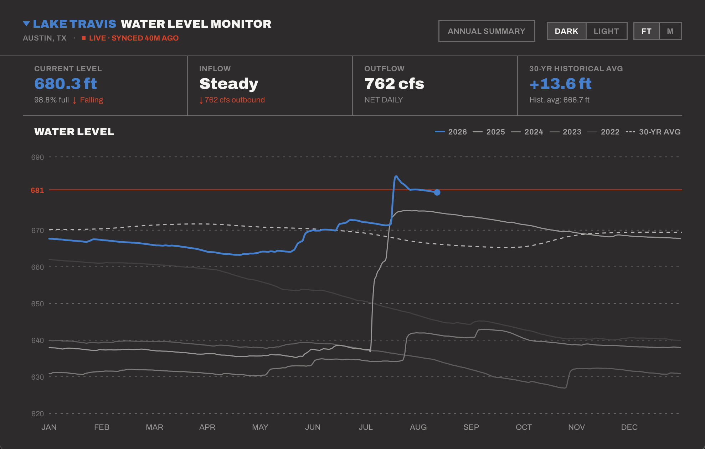

# LakeLevel — Web

Live water level monitoring for all six LCRA Highland Lakes in Texas, at **[highlandlakelevels.org](https://highlandlakelevels.org)**. React / Vite / TypeScript, deployed on Netlify.

This repo was split out of the original [mtmangum/WaterLevel](https://github.com/mtmangum/WaterLevel) monorepo, which also contains a native macOS SwiftUI app sharing the same design and data source. Full history predating the split — including the macOS app — lives there.



## Features

- **All six Highland Lakes** — switch between Lake Buchanan, Inks, LBJ, Marble Falls, Travis, and Austin via the LAKE ▾ picker in the header
- **Dashboard** — current lake level, inflow, outflow, and vs-30-yr-average stats; updates automatically every hour
- **5-year overlay chart** — 2022–2026 lines on a shared Jan–Dec axis; current year in blue with a live endpoint dot
- **Year toggles** — single-tap hides/shows a year; double-tap isolates it
- **Interactive crosshair** — hover shows interpolated water level (ft) for every visible year
- **Drag to zoom** — drag across the chart to zoom into a date range; RESET to restore full view
- **Annual Summary popover** — header button opens a live min/max/avg/year-end table for the selected lake
- **Feet / meters toggle** — all displayed levels convert between units; chart gridlines pick unit-appropriate step sizes
- **Dark / Light mode** — toggled from the header; default is dark
- **Mobile-responsive** — stacking header/stat grid, touch-enabled chart (tap for tooltip, drag to zoom), full-screen Annual Summary sheet under 640px
- **Shareable links** — `?lake=` deep links to a specific lake

## Design

Flat modernist system: zero corner radius, 1px rule dividers, neutral ramp + `#2B82D4` water blue + `#EC3013` accent red. Tokens defined in `src/theme.ts`.

## Data & caching

Daily readings come from [waterdatafortexas.org](https://waterdatafortexas.org/) (LCRA). The full historical record only ever needs the last ~30 years (used for 30-yr monthly averages and the current-year reading), so it's trimmed server-side before caching.

- An hourly scheduled function (`netlify/functions/sync-lake-data.js`) pre-fetches every lake's CSV and writes it, trimmed, into a shared Netlify Blobs store.
- `netlify/functions/lake-csv.js` serves from that store (a few hundred ms) instead of round-tripping to the upstream on every request, falling back to a live fetch + write-through on a cold miss.
- The client fetches once per lake (no separate "recent" request — it's derived from the same trimmed historical set) and caches in-memory for the session.

| Lake | Full Pool |
|---|---|
| Lake Buchanan | 1020.5 ft MSL |
| Lake Inks | 888.25 ft MSL |
| Lake LBJ | 824.0 ft MSL |
| Lake Marble Falls | 738.5 ft MSL |
| Lake Travis | 681.0 ft MSL |
| Lake Austin | 492.0 ft MSL |

## Local development

```
npm install
npm run dev
```

`vite.config.ts` proxies `/api/*` straight to waterdatafortexas.org in dev, bypassing the Netlify function. To test the actual functions (Blobs caching, scheduled sync) locally, use the Netlify CLI instead:

```
netlify dev
```

## Deployment

Netlify auto-builds and deploys on every push:
- `main` → production, [highlandlakelevels.org](https://highlandlakelevels.org)
- `dev` → preview, `dev--brilliant-churros-222631.netlify.app` (noindexed, separate Blobs cache — safe to test against without touching production data)

## Project structure

```
├── index.html
├── netlify.toml               — build config + /api/* redirect
├── netlify/
│   ├── functions/
│   │   ├── lake-csv.js         — serves cached CSV data, falls back to live fetch
│   │   └── sync-lake-data.js   — hourly scheduled cache warmer
│   └── lib/
│       ├── lakeStore.js        — per-deploy-context Blobs store helper
│       └── trimHistory.js      — trims CSV to the last 31 years
├── public/
│   └── favicon.svg
└── src/
    ├── App.tsx
    ├── theme.ts                 — COLORS + makeTheme(isDark)
    ├── units.ts                 — ft/m conversion helpers
    ├── components/
    │   ├── Header.tsx
    │   ├── StatGrid.tsx
    │   ├── DashboardChart.tsx
    │   └── AnnualSummary.tsx
    ├── hooks/
    │   └── useAppState.ts       — lake selection, data fetching, derived stats
    └── data/
        ├── lakes.ts             — Lake definitions + coordinate helpers
        └── lakeDataService.ts   — CSV fetch + parse
```
